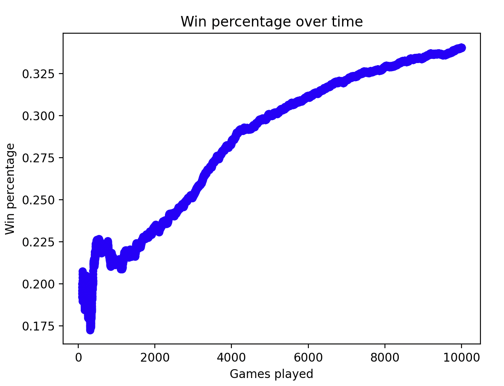

# CoupAI
## Developing AI agents for the card game Coup

Overview of Coup: With 2 characters with unique abilities, Players use bluffing and strategy to try to be the last player standing.
Rules: https://github.com/DanielBrey15/CoupAI/blob/main/CoupRules.pdf (Rules also in CoupRules.pdf)

Initially I created functionality to play Coup and developed various AI players with different heuristics and strategies (These players and their game setup ca be found in the History directory). Now, I am currently designing and iterating on AI players that use machine learning to make their game decisions (CoupEnvironment directory).

### Important files in the CoupEnvironment directory:
* CoupEnvironment.py: The main script run - It creates the game and training environment, and teaches one of the players how to play over thousands of games.
* Services/GameMethods.py: The module containing many helper methods for CoupEnvironment.py.
* Players directory: Directory containing different AI agent classes. In the History directory, these each had different heuristics used to make decisions. In the current setup, these player classes will either have their own models or take in stored models as inputs to play Coup.

### Progress so far

The Coup AI has demonstrated it can learn and, while skipping over some of the rules of the actual game, win more than other agents that use strong heuristics.

## Next steps

### Game mechanics - There are parts of the game that I have removed while training the agent (such as making decisions based on its actual cards and calling out actions) and I need to add them back in.

* Include calling out probability
* Shuffle player order
* Train model to determine when the agent should call out an opponent's action
* Allow model to decide if it wants to lie about blocking

### Strengthen move making model

* Use different inputs to train the model (such as which cards we have and what moves have been made)
* Use supervised learning model (potentially XGBoost) to learn other features that my reinforcement model could apply to its state, such as the probability of an opponent having a certain card that can block your action.
* Give negative rewards for completing actions that are risky (such as those you cannot do based on your cards)
* Give negative rewards for moves where you are blocked (therefore wasting your turn)
* Experiment with other policy-based reinforcement algorithms to make moves (such as actor-critic / PPO)

### Program structure

* Store reinforcement model after training
* Inlcude reinforcement learning model within one player class, and have that player use makeMove (similar to the previous AIPlayer classes)
* Using work done in the History Repository, bring back the ActionLogger that saved all of the different actions completed in a game (including blocking, calling out, etc). This will be needed for feature engineering in the "Strengthen move making model" section
